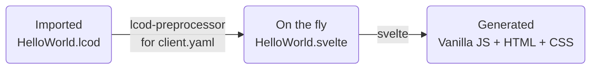

[](https://github.com/lcod-team/lcod-preprocessor/actions/workflows/ci.yml)
[](LICENSE)

# lcod-preprocessor

This project defines a [Svelte][1] [preprocessor](https://github.com/sveltejs/svelte-preprocess/) for `.lcod` folders containing a `client.yaml` descriptor.



## The client.yaml file

A `client.yaml` file can be defined in a `.lcod` component and it's used to describe sub componants (`.lcod` or `.svelte`) tree with their `slot` and `properties`.

## Usage

In your svelte project, edit the `svelte.config.js` to declare the `lcod-preprocessor`.

```js
import adapter from '@sveltejs/adapter-auto';
import { configureLcodPreprocessor } from './src/lib/lcod-preprocessor.mjs';

/** @type {import('@sveltejs/kit').Config} */
const config = {
	preprocess: configureLcodPreprocessor({ writeSvelte: true, uuid: true }),
	kit: {
		adapter: adapter()
	}
};

export default config;
```

## Motivation

Have [KISS](https://en.wikipedia.org/wiki/KISS_principle) piece of code to translate a structured descriptor (`yaml`) for a componants, pages or application.
Generating [Svelte][1] code allows to have benefits of all its avantages: fast and light compilation, `HMR` development and allows many `CSR`/`SSR` configurations.

[1]: https://svelte.dev/
